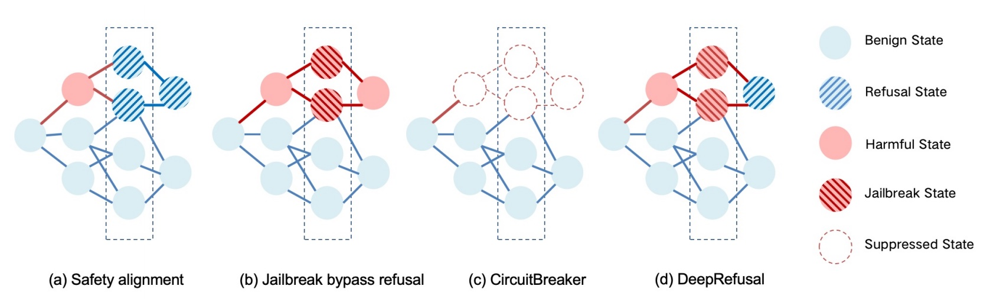

# [DeepRefusal] Beyond Surface Alignment: Rebuilding LLMs Safety Mechanism via Probabilistically Ablating Refusal Direction

- [[Paper](https://arxiv.org/abs/2509.15202)]

## News
- `[2026/04/09]` Our DeepRefusal-enhanced model is now available on HuggingFace: [Meta-Llama-3-8B-Instruct-DeepRefusal](https://huggingface.co/skysys00/Meta-Llama-3-8B-Instruct-DeepRefusal).
- `[2026/04/09]` We evaluated [**heretic**](https://github.com/p-e-w/heretic), presently the most prominent LLM censorship removal tool, and discovered—somewhat unexpectedly—that our approach exhibits strong resilience against such attacks. Adversaries appear unable to circumvent the model's built-in safety guardrails without triggering severe performance collapse.


----

*This work is built on [Refusal Direction](https://github.com/andyrdt/refusal_direction) and [CircuitBreaker](https://github.com/GraySwanAI/circuit-breakers/tree/main). Please refer to the corresponding repository for the code to obtain the refusal direction and output evaluation.*



We present DeepRefusal, a representation-engineering approach that rebuilds safety mechanisms inside large language models. During fine-tuning we probabilistically ablate the refusal direction across layers and token positions, forcing the model to reactivate its own refusal behavior after it has been disabled. Instead of relying on surface-level alignment, DeepRefusal trains the model to recover safe outputs even when internal representations are compromised. Across four open-source model families and six attack types, this internal-reconstruction strategy cuts attack-success rates by roughly 95 % while preserving downstream task performance, offering a practical path from shallow alignment to deep, self-repairing robustness.


# Citation
```
@inproceedings{xie-etal-2025-beyond,
    title = "Beyond Surface Alignment: Rebuilding {LLM}s Safety Mechanism via Probabilistically Ablating Refusal Direction",
    author = "Xie, Yuanbo  and
      Zhang, Yingjie  and
      Liu, Tianyun  and
      Ma, Duohe  and
      Liu, Tingwen",
    editor = "Christodoulopoulos, Christos  and
      Chakraborty, Tanmoy  and
      Rose, Carolyn  and
      Peng, Violet",
    booktitle = "Findings of the Association for Computational Linguistics: EMNLP 2025",
    month = nov,
    year = "2025",
    address = "Suzhou, China",
    publisher = "Association for Computational Linguistics",
    url = "https://aclanthology.org/2025.findings-emnlp.956/",
    pages = "17620--17632",
    ISBN = "979-8-89176-335-7",
    abstract = "Jailbreak attacks pose persistent threats to large language models (LLMs). Current safety alignment methods have attempted to address these issues, but they experience two significant limitations: insufficient safety alignment depth and unrobust internal defense mechanisms. These limitations make them vulnerable to adversarial attacks such as prefilling and refusal direction manipulation. We introduce DeepRefusal, a robust safety alignment framework that overcomes these issues. DeepRefusal forces the model to dynamically rebuild its refusal mechanisms from jailbreak states. This is achieved by probabilistically ablating the refusal direction across layers and token depths during fine-tuning. Our method not only defends against prefilling and refusal direction attacks but also demonstrates strong resilience against other unseen jailbreak strategies. Extensive evaluations on four open-source LLM families and six representative attacks show that DeepRefusal reduces attack success rates by approximately 95{\%}, while maintaining model capabilities with minimal performance degradation."
}
```
or
```
@misc{xie2025surfacealignmentrebuildingllms,
      title={Beyond Surface Alignment: Rebuilding LLMs Safety Mechanism via Probabilistically Ablating Refusal Direction}, 
      author={Yuanbo Xie and Yingjie Zhang and Tianyun Liu and Duohe Ma and Tingwen Liu},
      year={2025},
      eprint={2509.15202},
      archivePrefix={arXiv},
      primaryClass={cs.CR},
      url={https://arxiv.org/abs/2509.15202}, 
}
```
